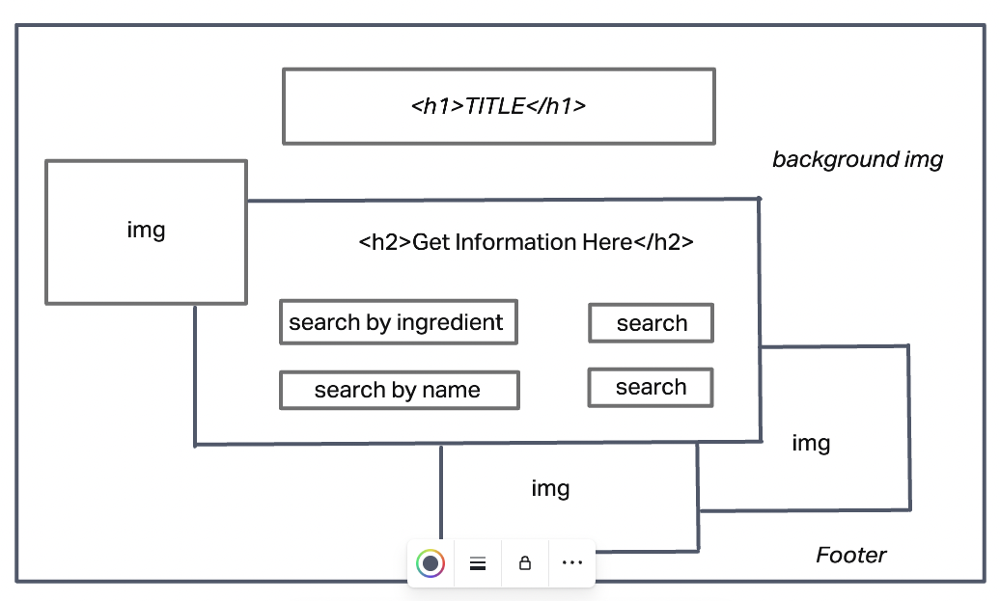
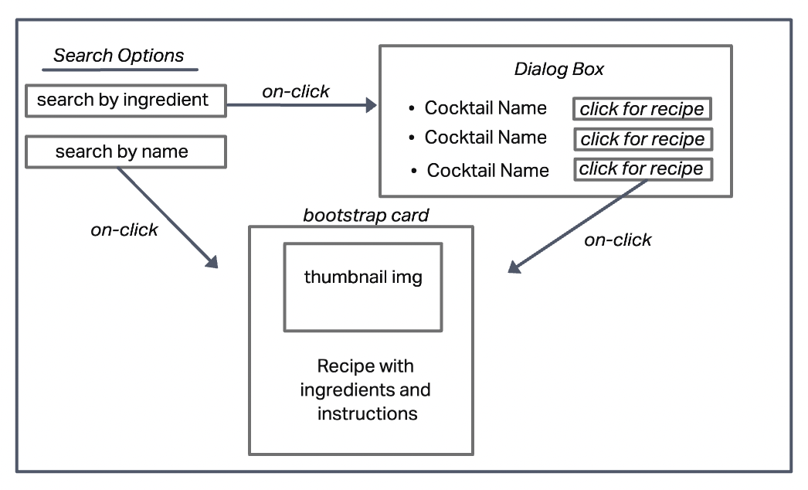

# TITLE

A simple web application that allows users to search for cocktail recipes.

# User Stories

- As a user, I should be able to type in a cocktail name and return a recipe with ingredients and instructions.

- As a user, I should be able to type in an ingredient and return a list of cocktails containing that ingredient.

    - I should also be able to click on each cocktail in the list and return a recipe with ingredients and instructions.

- As a user, I would like to see an image associated with each cocktail.

# Technologies Used

- HTML5
- CSS3
- Javascript
- Bootstrap

# Screenshots

# Getting Started

<!-- [Click here](hosted/deployed app url) to ! -->

[Click here]() to see the deployed app!

# Future Enhancements

- Add ability for users to save a list of favorite recipes.

- Add ability for users to save a shopping list for their recipe that can be "checked off" as items are aquired. 

- Add links to search for stores near them where they can purchase ingredients, glassware, or bar tools.

- Add videos associated with each drink

# STILL TO COMPLETE:
1. finish README.md: change wirefram screenshots, add completed app screenshots, add link to completed/deployed app.
2. deploy app to Netlify

