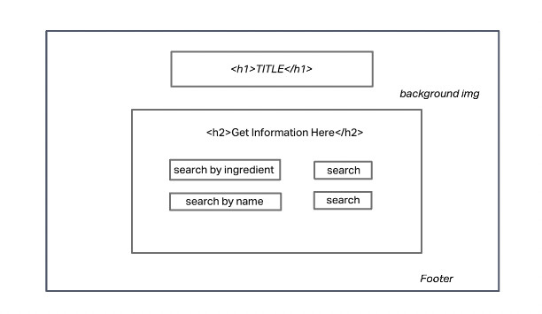
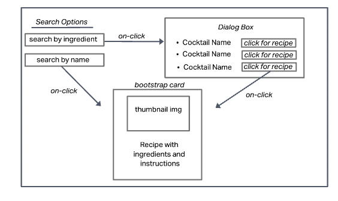
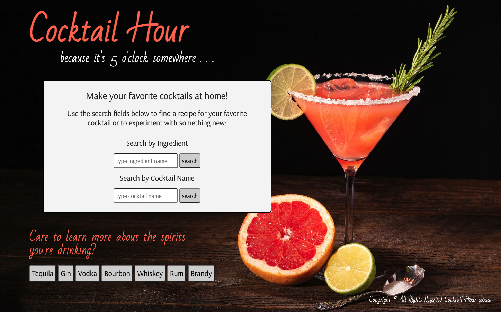
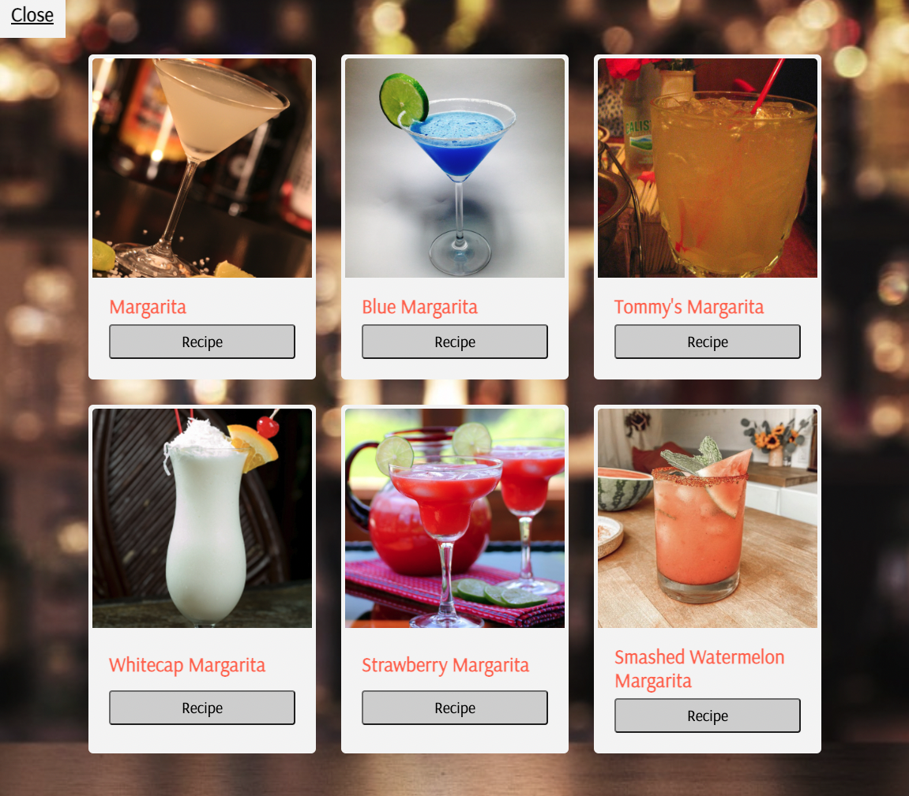
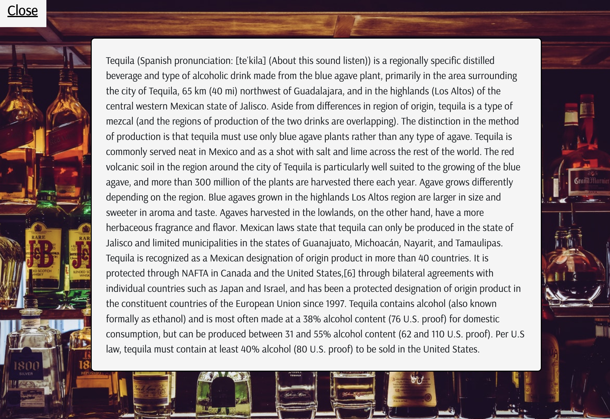

# COCKTAIL HOUR

A simple web application that allows users to search for cocktail recipes.

# User Stories

- As a user, I should be able to type in a cocktail name and return a recipe with ingredients and instructions.

- As a user, I should be able to type in an ingredient and return a list of cocktails containing that ingredient.

    - I should also be able to click on each cocktail in the list and return a recipe with ingredients and instructions.

- As a user, I would like to see an image associated with each cocktail.

# Technologies Used

- HTML5
- CSS3
- Javascript
- Bootstrap
- Google Fonts
- Cocktail DB API (https://www.thecocktaildb.com/)

# Screenshots

# Getting Started

<!-- [Click here](hosted/deployed app url) to ! -->

[Click here](https://guileless-profiterole-9b97c3.netlify.app) to see the deployed app!

# Future Enhancements

- Add ability for users to save a list of favorite recipes

- Add ability for users to create and save a shopping list for their recipe that can be "checked off" as items are acquired

- Add abiity to search for stores nearby where the user can purchase ingredients, glassware, or bar tools

# Developer Enhancements

- Known issue with API- "search by ingredient" only returns drinks that have the ingredient in the name of the cocktail (based on structure of API). API will allow you to search by ingredients, but it only returns id, name, and image- no recipie. Need to add additional filters or search paramaters to the API or create a button on each drink returned by "search by ingredient" query that will link to the receipe for that drink.

- Add "back to top" button for drink modal

- Make sure app is completely accessible to those with disabilities

- Enhance CSS (button styling and styling of home page)

